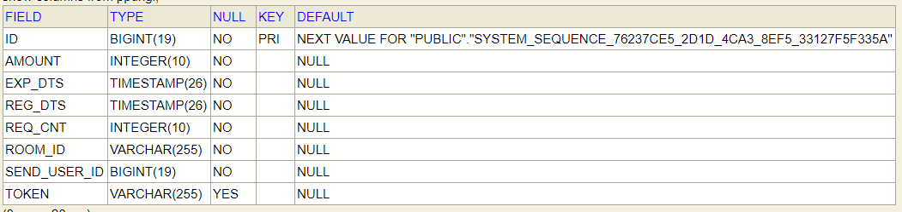
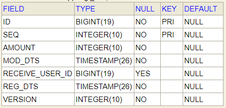

# sn-study-project
@anna.1na
@amjay.shin
## 요구사항
요구 받은 것들을 요구사항이라고 부릅니다.
## 개발환경
- Java 8
- Spring Boot 2.4.5
- JPA
- H2
- Maven
## API 명세
1. 뿌리기 API
- Url : /ppurigi
- Method : POST
- Header :
    - X-USER-ID : 사용자ID (Long)
    - X-ROOM-ID : 채팅방ID (String)
- 요청 파라미터

| 파라미터명 | 타입 | 설명 |
|---|---|---|
| reqCnt | Integer | 받아갈 대상의 숫자 |
| amount | Integer | 뿌린 금액 |
- 요청 예시
```
{
    "reqCnt" : 3,
    "amount" : 10000
}
```
- 응답 파라미터

| 파라미터명 | 타입 | 설명 |
|---|---|---|
| resultCode | String | 결과코드 |
| resultMessage | String | 결과메세지 |
| result | Object | 결과상세 |
| result.token | String | 토큰 |

- 응답 예시
```
{
    "resultCode" : "SUCCESS",
    "resultMessage" :  "뿌리기 요청 성공",
    "result" : {
        "token" : "ABC"
    }
}
```
2. 받기 API
- Url : /ppurigi
- Method : PUT
- Header :
    - X-USER-ID : 사용자ID (Long)
    - X-ROOM-ID : 채팅방ID (String)
- 요청 파라미터

| 파라미터명 | 타입 | 설명 |
|---|---|---|
| token | String | 토큰 |
- 요청 예시
```
{
    "token" : "ABC"
}
```
- 응답 파라미터

| 파라미터명 | 타입 | 설명 |
|---|---|---|
| resultCode | String | 결과코드 |
| resultMessage | String | 결과메세지 |
| result | Object | 결과상세 |
| result.amount | String | 받은 금액 |

- 응답 예시
```
{
    "resultCode" : "SUCCESS",
    "resultMessage" :  "뿌리기 받기 성공",
    "result" : {
        "amount" : "1000"
    }
}
```

3. 조회 API
- Url : /ppurigi
- Method : GET
- Header :
    - X-USER-ID : 사용자ID (Long)
- 요청 파라미터

| 파라미터명 | 타입 | 설명 |
|---|---|---|
| token | String | 토큰 |
- 요청 예시
```
GET http://localhost:8080/ppurigi?token=ABC
```
- 응답 파라미터

| 파라미터명 | 타입 | 설명 |
|---|---|---|
| resultCode | String | 결과코드 |
| resultMessage | String | 결과메세지 |
| result | Object | 결과상세 |
| result.regDts | Date | 뿌린 시각 |
| result.amount | Integer | 뿌린 금액 |
| result.received | Integer | 받기 완료된 금액 |
| result.receivedList[] | Object | 받기 완료된 정보 [받은 금액, 받은 사용자ID] |

- 응답 예시
```
{
    "resultCode": "SUCCESS",
    "resultMessage": "뿌리기 조회 성공",
    "result": {
        "amount": "10000",
        "regDts": "2021-05-11 09:00:00",
        "receivedList": [
            [
                "7000",
                "163233"
            ],
            [
                "3000",
                "163234"
            ]
        ],
        "received": "10000"
    }
}
```

## DB 설계
- ppurigi



- ppurigi_dtlc



## 문제해결 전략
1. 토큰 생성 전략
- 토큰은 3자리 문자열로 제한
- 62 BaseEncoding을 할 경우 238,328 까지 가능
- 1초에 50개의 토큰 생성 요청까지 받을 수 있도록 System.currentTimeMillis() % TIME 적용
- 중복된 토큰인 경우 실패 응답
- 이슈 : 토큰 중복인 경우 실패 응답을 내려주는 것이 맞는지? 아니면 유효한 토큰이 생성될 떄까지 while 적용?

2. 뿌릴 금액 분배
- 받을 수 있는 사람만큼 뿌릴 금액을 미리 분배해 ppurigi_dtlc 테이블에 INSERT
- 금액은 랜덤하게 넣음 (1원 <= 금액 <= 뿌린 금액 - (인원 - 1))

3. 동시 받기 이슈
- 동시에 두 사람이 같은 ppurigi_dtlc에 접근한 경우 (id=1, seq=2)
- ppurigi_dtlc 에 version 컬럼 추가 후, @OptimisticLocking(type = OptimisticLockType.VERSION) 적용